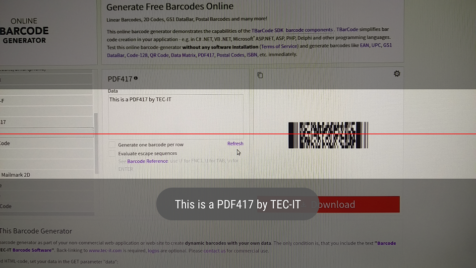

# Barcode Scanner

App Barcode Scanner using [zxing](https://github.com/zxing/zxing) library and native camera



### Architecture

Clean Architecture, app core has 3 modules:

- camera: configure & init native camera, take a simple image preview (NV21 format) and convert to YUV image
- decoder: use com.google.zxing.Reader (PDF417Reader, QRCodeReader...) interfaz to read barcode into YUV image taken by camera
- manager: compose by camera and decoder module. Set an interval to take image from camera and send to decoder for read barcode

### Usage

Configure your [Reader](https://github.com/zxing/zxing/blob/master/core/src/main/java/com/google/zxing/Reader.java)  modifying 'decoderModule' from [Koin](https://github.com/InsertKoinIO/koin) configuration

```kotlin
val decoderModule = module {
    single<IBarCodeDecoder> { BarCodeDecoderImp(get(), get(), get(), get()) }
    single<Map<DecodeHintType, *>> {
        mapOf(
            Pair(DecodeHintType.TRY_HARDER, true),
            Pair(DecodeHintType.PURE_BARCODE, true),
            Pair(DecodeHintType.CHARACTER_SET, "ISO-8859-1"),
            Pair(DecodeHintType.POSSIBLE_FORMATS, listOf(BarcodeFormat.PDF_417))
        )
    }
    single<Reader> { PDF417Reader() } // Change this for other barcode types
}
```

### PDF417 barcode sample

By default app is config to read PDF417 barcode, you can check with this:


[Barcode GENERATOR](https://barcode.tec-it.com/en)

